<p align="center"></p>

# yt-adr-feed

YouTube transcript monitor — Qdrant vector storage + GitHub ADR pipeline.

**No generative AI at runtime.** Embeddings (sentence-transformers) are the only model — deterministic math for vector search, not reasoning. This tool feeds the [Fabric-SDK](https://github.com/git-fabric/sdk) ADR library with structured knowledge from YouTube content, expanding coverage across AI governance, infrastructure, security, and compliance domains.

## What It Does

1. Monitors configured YouTube channels for new videos (via `yt-dlp`, no API key needed)
2. Captures and cleans transcripts (`youtube-transcript-api`)
3. Extracts keywords using TF-IDF (scikit-learn — deterministic, no AI)
4. Generates vector embeddings (sentence-transformers, local CPU inference)
5. Stores transcripts + embeddings in Qdrant for semantic search
6. Outputs structured markdown in pre-ADR format
7. Creates GitHub PRs with transcript batches for review

## Why This Exists

The Fabric-SDK ADR library covers OWASP LLM Top 10, NIST AI RMF, and ISO 42001. YouTube channels from IBM Technology, NIST, OWASP, and others publish content that directly informs these governance decisions. Instead of manually watching and summarizing, yt-adr-feed captures transcripts, makes them searchable, and feeds them into the ADR review pipeline.

Every transcript indexed is context the fabric ecosystem can route to instead of asking Claude.

## Architecture

```
YouTube Channels
    | yt-dlp (channel scan, no API key)
Video List
    | youtube-transcript-api
Raw Transcripts
    | TF-IDF keyword extraction (scikit-learn)
    | sentence-transformers embedding (local CPU)
    | Qdrant vector storage
    | Markdown formatter
Pre-ADR Files -> Git Branch -> GitHub PR -> Review -> Merge
```

## Quick Start

```bash
# Install
pip install -e ".[dev]"

# Configure
cp config/channels.yaml my-config.yaml
# Edit with your channels

# Run (local, no Qdrant/Git)
yt-adr-feed --config my-config.yaml fetch --skip-qdrant --skip-git

# Run with Qdrant
yt-adr-feed --config my-config.yaml fetch --skip-git

# Run full pipeline (Qdrant + GitHub PR)
export GITHUB_TOKEN=your_token
yt-adr-feed --config my-config.yaml fetch

# Search transcripts
yt-adr-feed --config my-config.yaml search --query "kubernetes networking"

# Validate configuration
yt-adr-feed --config my-config.yaml validate
```

## CLI Commands

| Command | Description |
|---------|-------------|
| `fetch` | Scan channels, capture transcripts, embed, store, format markdown |
| `push` | Push existing transcript files to GitHub via PR |
| `search` | Semantic search Qdrant for transcripts |
| `validate` | Check config, Qdrant connectivity, git auth |

## Deployment (k3s)

```bash
# Build container (enforces linux/amd64)
make docker-build VERSION=0.1.0

# Deploy via Helm (CronJob, every 6 hours)
make helm-install VERSION=0.1.0
```

Image tags are immutable — once pushed, never overwritten.

## Configuration

See `config/channels.yaml` for the full schema:

- **channels** — YouTube channels to monitor (handle or ID, per-channel controls)
- **qdrant** — Vector database connection (host, port, collection, embedding model)
- **git** — GitHub repo for PR workflow (repo URL, branch target, author)
- **output** — Local markdown output (directory, file prefix, numbering)

## Project Structure

```
src/yt_adr_feed/
    __init__.py         # version
    __main__.py         # python -m entry point
    cli.py              # Click CLI (fetch, push, search, validate)
    channels.py         # YouTube channel monitor (yt-dlp)
    transcript.py       # Transcript fetcher + chapter extraction
    keywords.py         # TF-IDF keyword extraction
    embeddings.py       # sentence-transformers local embedder
    storage.py          # Qdrant vector storage
    formatter.py        # ADR markdown formatter
    git_ops.py          # GitHub PR workflow
    config.py           # Pydantic config loader
    exceptions.py       # Error types
config/
    channels.yaml       # Channel configuration
helm/
    yt-adr-feed/        # Helm chart (CronJob)
tests/
    unit/               # Unit tests
    integration/        # Integration tests
```

## ADR Alignment

This tool follows the guardrails established in the Fabric-SDK ADR suite:

- **No generative AI** — deterministic pipeline, embeddings only (AI-ADR-008)
- **Immutable tags** — Docker image tags never overwritten (AI-ADR-011)
- **Least privilege** — non-root container, scoped secrets (AI-ADR-006)
- **Append-only storage** — Qdrant entries created, never overwritten (AI-ADR-007)
- **PR workflow** — transcripts reviewed before merge (AI-ADR-011)

## Development

```bash
make install    # pip install -e ".[dev]"
make test       # pytest with coverage
make lint       # ruff check + format
make format     # auto-format
```

## License

MIT

<!-- org-footer -->
---

<p align="center"><sub>Part of <a href="https://github.com/git-fabric">git-fabric</a> · composable fabric apps for Git-native infrastructure · built by <a href="https://github.com/ry-ops">ry-ops</a></sub></p>
